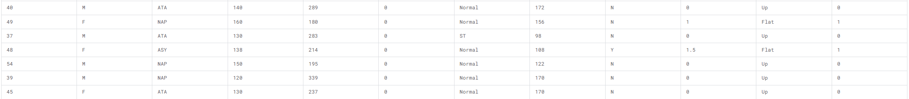

# Heart Failure Prediction
Heart Failure Prediction is my project for Machine Learning Zoomcamp 2024. This project implements all the learned in the course.

# Problem description

Cardiovascular diseases (CVDs) are the number 1 cause of death globally, taking an estimated 17.9 million lives each year, which accounts for 31% of all deaths worldwide. Four out of 5CVD deaths are due to heart attacks and strokes, and one-third of these deaths occur prematurely in people under 70 years of age. Heart failure is a common event caused by CVDs and this dataset contains 11 features that can be used to predict a possible heart disease.

People with cardiovascular disease or who are at high cardiovascular risk (due to the presence of one or more risk factors such as hypertension, diabetes, hyperlipidaemia or already established disease) need early detection and management wherein a machine learning model can be of great help.

# Dataset
The dataset was found as a [Kaggle](https://www.kaggle.com/datasets/fedesoriano/heart-failure-prediction) dataset. Sample data:



### Attribute Information

1. **Age**: age of the patient \[years\]
2. **Sex**: sex of the patient \[M: Male, F: Female\]
3. **ChestPainType**: chest pain type \[TA: Typical Angina, ATA: Atypical Angina, NAP: Non-Anginal Pain, ASY: Asymptomatic\]
4. **RestingBP**: resting blood pressure \[mm Hg\]
5. **Cholesterol**: serum cholesterol \[mm/dl\]
6. **FastingBS**: fasting blood sugar \[1: if FastingBS > 120 mg/dl, 0: otherwise\]
7. **RestingECG**: resting electrocardiogram results \[Normal: Normal, ST: having ST-T wave abnormality (T wave inversions and/or ST elevation or depression of > 0.05 mV), LVH: showing probable or definite left ventricular hypertrophy by Estes' criteria\]
8. **MaxHR**: maximum heart rate achieved \[Numeric value between 60 and 202\]
9. **ExerciseAngina**: exercise-induced angina \[Y: Yes, N: No\]
10. **Oldpeak**: oldpeak = ST \[Numeric value measured in depression\]
11. **ST\_Slope**: the slope of the peak exercise ST segment \[Up: upsloping, Flat: flat, Down: downsloping\]
12. **HeartDisease**: output class \[1: heart disease, 0: Normal\]

## Project directories

[](https://github.com/kiramishima/anemia-detection-mlops?tab=readme-ov-file#project-directories)

- **DATASET**
    - It contains the dataset.
- **docker-images**
    - It contains the docker file for deploying the service.
- **heart_failure**
    - Contains code for deply the service.
- **IaC**
    - It contains the terraform files for deploy the infrastructure on AWS. Also, how deploy the infrastructure.
- **models**
    - It contains the models generated by the notebooks.
- **notebooks**
    - It contains jupyter notebooks.
- **scripts**
    - It contains the Dockerfile for the mage-ai project, mlflow and evidently.

`images` directory only contains the images for the markdown.

# Notebooks

- **exploratory-data-analysis.ipynb**
    - This notebook contains exploratory data analysis.
- **notebook.ipynb**
    - This notebook contains preprocessing, training and saving model.
- **train.py**
    - Train models and saves.

# Reproducibility

## Local

1. Build docker image
    ```sh
    docker build -t heart-api -f docker-images/heart.Dockerfile .
    ```
2. Run Makefile
    ```docker
        docker run -it \
            --rm \
            --name predictor \
            -p 9696:9696 \
            -e "RUN_ID=LogisticRegression" \
            heart-api
    ```
2. Execute `make deploy_local`

## AWS

1. cd `IaC`
2. Copy `sample.vars.tfvars` to `vars.tfvars`
3. Configure `vars.tfvars`
4. Configure you AWS Credentials with `aws configure`. (If you don´t have installed AWS CLI, you need install it with `pip install awscli`)
5. Run Makefile
6. Execute `make deploy_aws`
7. Execute:
    ```sh
        # Authenticate in ECR
        aws ecr get-login-password --region us-east-1 | docker login --username AWS --password-stdin $(terraform output -raw ecr_repository_url)

        # Build the image
        docker build -t heart-failure-predictor .

        # Tag the image
        docker tag heart-failure-predictor:latest $(terraform output -raw ecr_repository_url):latest

        # Upload the image
        docker push $(terraform output -raw ecr_repository_url):latest
    ```


# Testing Endpoint

Call Endpoint
```bash
curl -X POST -H "Content-Type: application/json" -d @sample.json localhost:9696/predict
```

Response

```json
{
    "heart_failure":true,
    "heart_failure_probability":0.762
}
```

Test Endpoint in AWS

```sh
#!/bin/bash

# Obtener el DNS del ALB (asumiendo que ya ejecutaste terraform output)
ALB_DNS=$(terraform output -raw alb_dns_name)

# Datos de ejemplo para la predicción
PATIENT_DATA='{
    "Age": 49,
    "Sex": "F",
    "ChestPainType": "NAP",
    "RestingBP": 160,
    "Cholesterol": 180,
    "FastingBS": 0,
    "RestingECG": "Normal",
    "MaxHR": 156,
    "ExerciseAngina": "N",
    "Oldpeak": 1.0,
    "ST_Slope": "Flat"
}'

# Verificar que el servicio está funcionando
echo "Verificando el estado del servicio..."
curl -X GET http://${ALB_DNS}/health

# Realizar una predicción
echo -e "\nRealizando predicción..."
curl -X POST \
    -H "Content-Type: application/json" \
    -d "${PATIENT_DATA}" \
    http://${ALB_DNS}/predict
```